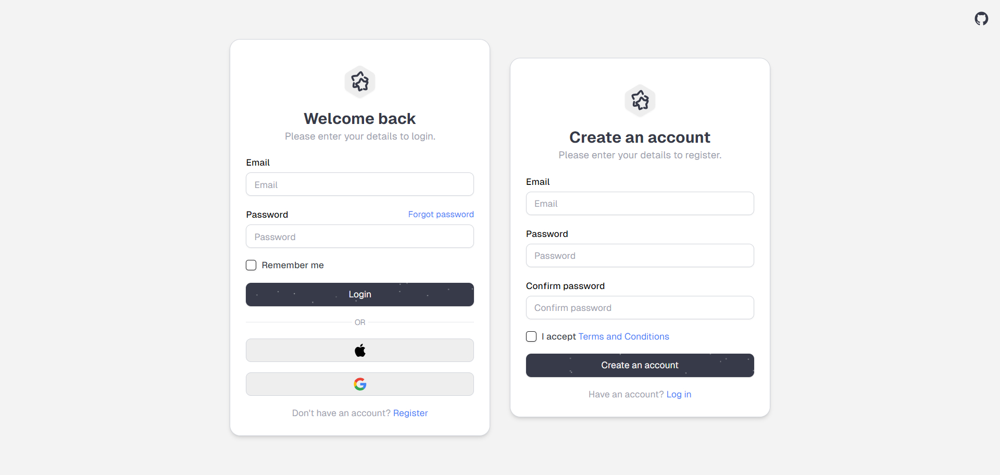

# <h3 align="center"> Awesome SignIn and SingUp forms | NextJs</h3>

<h4 align="center">Welcome to the Awesome SignIn and SingUp form project repository! We would like to present to you the incredible SignIn and SignUp forms for your project!</h3>

[]

## 🤖 About TaxPal

These are fully validated components using Zod for your project! You just need to add them to your project!

## 🛠 Technologies Used

We've assembled quite the tech stack to bring Express to life:

- [React](https://react.dev/)
- [NextJs](https://nextjs.org/)
- [TypeScript](https://www.typescriptlang.org/)
- [Zod](https://zod.dev/)
- **Libraries:** [`TailwindCss`](https://tailwindcss.com/), [`Shadcn.UI`](https://ui.shadcn.com/)

## 🚀 Getting Started

- Clone the repository
- Install dependencies with `npm install`

```bash
 npm install
```

- Run the development server with `npm run dev`

```bash
 npm run dev
```

- Open your browser and navigate to `http://localhost:3000`

## 📜 Disclaimer

These forms is a fictional company created for demonstration purposes only. Any resemblance to real companies, living or dead, is purely coincidental.

## 🤝 Contributing

While Awesome SignIn and SingUp forms isn't a real company, your contributions to this project are real and valued! Feel free to open issues or submit pull requests if you have ideas for improvements. Thank you!
